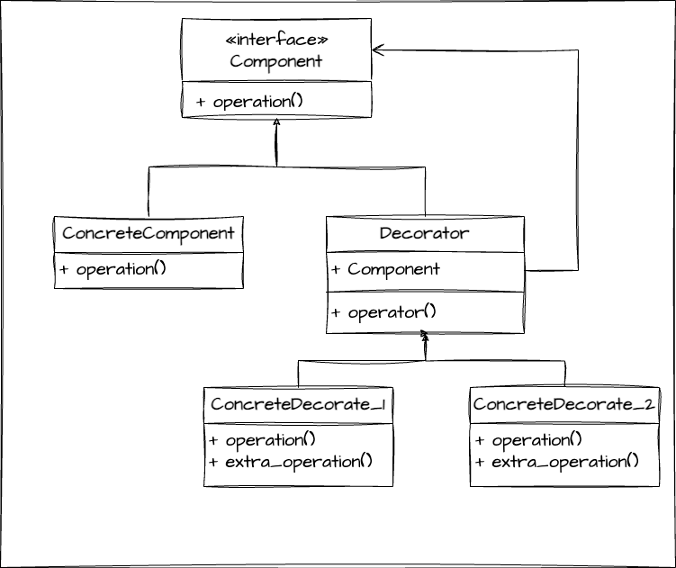

# 기존의 코드를 변경하지 않고 부가적인 기능을 추가 할 수 있다.



```java
public class Client {

    private CommentService commentService;

    public Client(CommentService commentService) {
        this.commentService = commentService;
    }

    private void writeComment(String comment){
        commentService.addComment(comment);
    }

    public static void main(String[] args) {
        Client client = new Client(new CommentService());
        client.writeComment("안녕");
        client.writeComment("Hi...");
    }

}
```

# 무엇이 문제일까?
사용자의 코멘트에 불필요한 문자들을 삭제 해달라는 요구사항이 들어왔다.
그럼 내가 할 수 있는 생각은...
1. TrimmingCommentService로 CommentService를 확장한다.
구현하고 나서 또 요구사항이 들어왔다. 이번엔 스팸문자들을 삭제 해달라고 한다.
2. SpamFilteringCommentService로 CommentService를 확장한다.
...
근데 둘 다 동시에 해달라고 한다면 상속에 문제가 있음을 깨닫게 됩니다.
단일상속만 가능하기 때문입니다.

# 장점
- A 기능, B 기능... n 기능 등 계속해서 부가적인 기능이 추가 되어야 하는 상황이라면 적합합니다.

# 단점
- 부가기능이 붙는 조건들이 있다면 데코레이터들을 조합하는 코드가 복잡해질 수는 있습니다.
