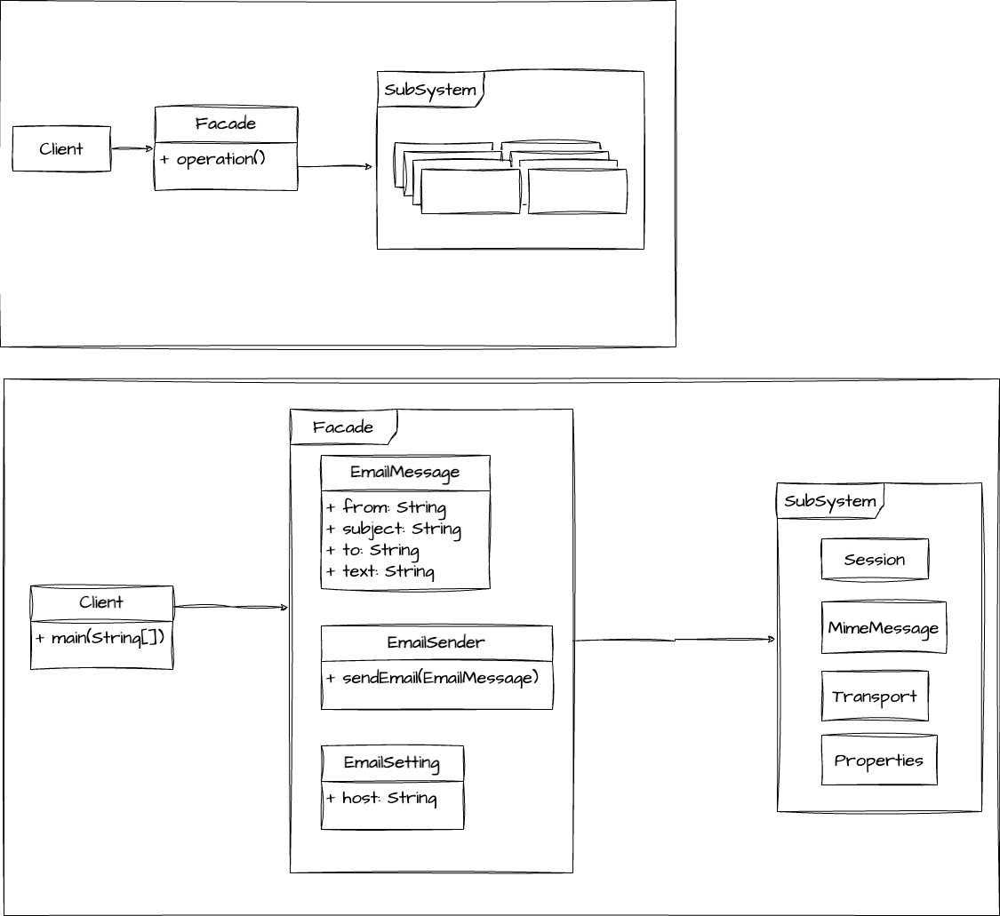

# 겉에서 본 건물의 외벽과 같은 패턴
> 겉에서 본 건물의 외벽은 깔끔하다. 속에 복잡하게 얽힌 미로가 있을지언정



```java
public class Client {

    public static void main(String[] args) {
        String to = "tom@tom.com";
        String from = "jerry@jerry.com";
        String host = "127.0.0.1";

        Properties properties = System.getProperties();
        properties.setProperty("mail.smtp.host", host);

        Session session = Session.getDefaultInstance(properties);

        try {
            MimeMessage message = new MimeMessage(session);
            message.setFrom(new InternetAddress(from));
            message.setSubject("Test Mail");
            message.setText("Test Text");

            Transport.send(message);
        }catch (MessagingException e){
            e.printStackTrace();
        }
    }

}
```

# 무엇이 문제인가?
강한 결합이 문제!
가급적 유연하게 느슨한 결합을 하는게 중요한데 이 코드는 강하게 결합 되어있음.
강하게 결합이 되어 있을 수록 의존성이 많고 결합이 강할 수록 코드 변경이 어렵고 테스트도 어렵다.

# 선생님 진행방식
1. Client에 통으로 짜여있는 소스를 분해.
    - 메세지의 내용을 결정하는 부분 -> EmailMessage
    - 메세지 설정을 하는 부분 -> EmailSettings
    - 메세지를 보내는 부분 -> EmailSender

# 장점
- 디테일한 기능들은 서브 클래스에 숨겨놓았기 때문에 깊이 있는 학습을 좀 덜 필요로 합니다. 
  - 퍼사드 적용 전엔 클라이언트가 JavaEmail에 대해 깊이 알고 있어야 쓸 수 있지만
  - 적용 후엔 조금 덜 깊이 알아도 사용 가능합니다.
# 단점
- 퍼사드로 만든 서브 클래스가 모든 의존성을 가지게 된다.
