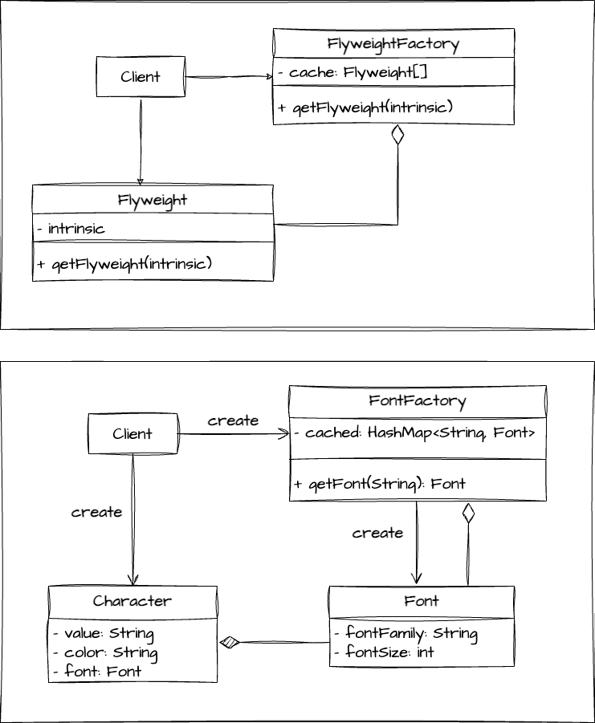

# 객체를 가볍게 만드는 패턴
> 변동이 많은 부분(extrinsic)과 변동이 적은 부분을 분리, 변동이 적은 부분(intrinsic)을 재사용 한다.



```java
public class Client {
    public static void main(String[] args) {
        Char c1 = new Char('h', "black","arial",14);
        Char c2 = new Char('e', "black","arial",14);
        Char c3 = new Char('l', "black","arial",14);
        Char c4 = new Char('l', "black","arial",14);
        Char c5 = new Char('o', "black","arial",14);
    }
}
```

# 무엇이 문제인가?
폰트에 관련된 부분은 자주 변경되지 않는 부분임에도 의미 없이 반복해서 코드를 넣는다.

# 선생님 진행방식
1. 변동이 적은 부분을 묶을 클래스를 만든다. (fontFamily와 fontSize가 Font 클래스로)
    - Flyweight에 해당하는 객체는 꼭 불변객체여야함!
2. 변동이 많은 부분을 클래스로 만들고 intrinsic를 의존한다.
3. intrinsic을 캐싱하고, 클라이언트가 접근할 수 있도록 해줄 FlyweightFactory를 만든다.
4. Client가 Char 를 만들때 **FontFactory**를 이용해 **Font** 인스턴스를 만들고 **Char**에 주입 해준다.

```java
public class Client {
    public static void main(String[] args) {
        FontFactory fontFactory = new FontFactory();
        Char ch1 = new Char('h', "white",fontFactory.getFont("aria:14"));
        Char ch2 = new Char('e', "white",fontFactory.getFont("aria:14"));
        Char ch3 = new Char('l', "white",fontFactory.getFont("aria:14"));
        Char ch4 = new Char('l', "white",fontFactory.getFont("aria:14"));
        Char ch5 = new Char('o', "white",fontFactory.getFont("aria:14"));
    }
}
```

# 장점
- 메모리 사용을 줄일 수 있다.

# 단점
- 코드가 복잡해진다.

# Flyweight가 사용되는 예제

- Integer의 valueOf()를 하면 일정 범위까진 캐시된 인스턴스
- 일정 범위 이상부턴 새로운 인스턴스

```java
public class FlyweightInJava {

   public static void main(String[] args) {
      Integer i1 = Integer.valueOf(10);
      Integer i2 = Integer.valueOf(10);
      System.out.println(i1 == i2); // true
      Integer i3 = Integer.valueOf(10000);
      Integer i4 = Integer.valueOf(10000);
      System.out.println(i3 == i4); // false
   }
}
```


