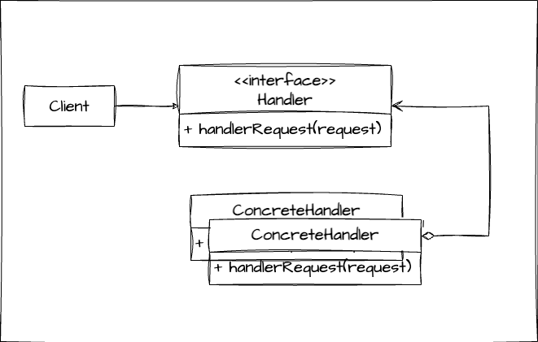

# 책임 연쇄 패턴
> 한가지 책임을 가진 객체들이 연결된 패턴
 


```java
//Client
public class Client {
    public static void main(String[] args) {
        Request request = new Request("무궁화 꽃이 피었습니다.");
        RequestHandler requestHandler = new RequestHandler();
        requestHandler.handler(request);
    }
}
//Request
public class Request {
    private String body;
    
    public Request(String body) {
        this.body = body;
    }

    public String getBody() {
        return body;
    }
}
//RequestHandler
public class RequestHandler {
    public void handler(Request request){
        System.out.println(request.getBody());
    }
}
```

# 무엇이 문제일까?
> 누가 `request`에 대한 인증과 인가 기능을 넣어달라고 요청했다면?

1. `handler` 메소드에 기능을 넣는다. 
   - 단일책임원칙을 위배
```java
//RequestHandler
public class RequestHandler {
    public void handler(Request request){
        //인증과 인가 기능
        System.out.println("인증");
        System.out.println(request.getBody());
    }
}
```
2. `RequestHandler` 클래스를 상속받는 클래스를 만들어서 기능을 넣는다.
   - `Client`가 `RequestHandler` 클래스를 상속받는 클래스를 알아야 합니다.
     - 이게 생각보다 큰 문제인게 기능이 하나씩 추가 될 때마다 클라이언트 로직에 계속 변경이 생김. 
```java
//Client
public class Client {
    public static void main(String[] args) {
        Request request = new Request("무궁화 꽃이 피었습니다.");
        RequestHandler requestHandler = new AuthRequestHandler();
        requestHandler.handler(request);
    }
}
//AuthRequestHandler
public class AuthRequestHandler extends RequestHandler {
    public void handler(Request request){
        System.out.println("인증");
        super.handler(request);
    }
}
//RequestHandler
public class RequestHandler {
    public void handler(Request request){
        System.out.println(request.getBody());
    }
}
```

# 선생님의 진행방식
- **최대한 `Client`가 구체적인 구현을 모르게 코드를 진행 시키는게 목표입니다.**


